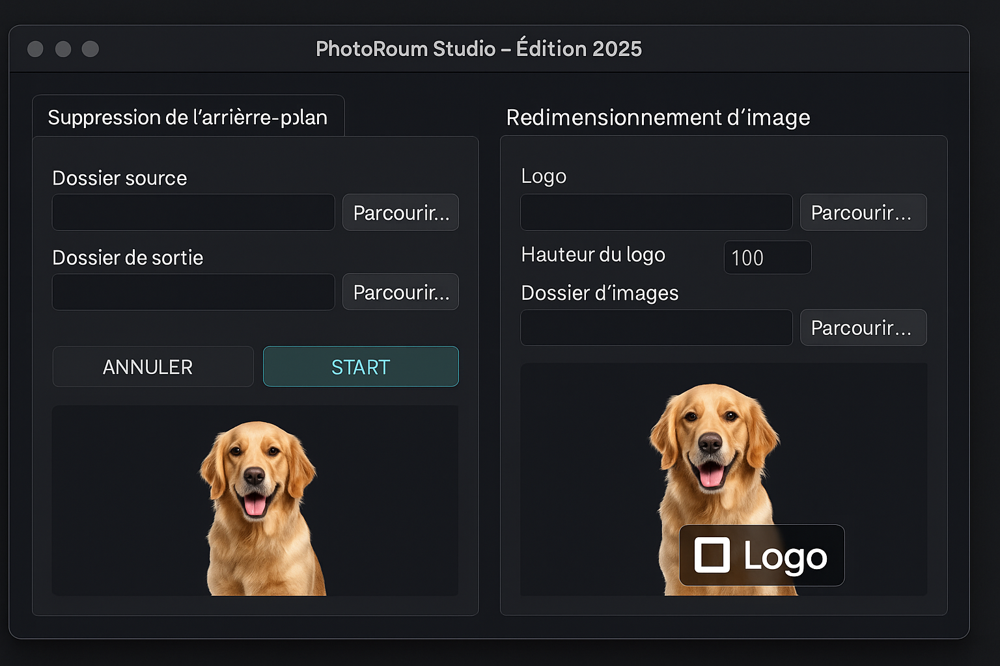

## 📸 PhotoRoom Studio - Édition 2025

**PhotoRoom Studio** est une application de bureau élégante et intuitive développée avec **Tkinter**, permettant :

- le **détourage automatique** d'images via l'API PhotoRoom,
- le **redimensionnement d'image** avec ajout d'un **logo personnalisé** centré en bas.

Le tout dans une interface sombre et futuriste 🎨.

---

### 🧰 Fonctionnalités

- ✅ Interface graphique moderne avec thème "Futuriste 2025"
- ✅ Onglet 1 : Suppression de l’arrière-plan via l’API PhotoRoom
- ✅ Onglet 2 : Redimensionnement d’image avec ajout de logo
- ✅ Prévisualisation instantanée du résultat
- ✅ Gestion de l'annulation de traitement
- ✅ Prise en charge de tous les formats courants (`.jpg`, `.jpeg`, `.png`, `.webp`, etc.)




### 📦 Installation

1. Clone le dépôt :
   ```bash
   git clone https://github.com/votre-utilisateur/photoroom-studio.git
   cd photoroom-studio
   ```

2. Installe les dépendances :
   ```bash
   pip install pillow requests
   ```

3. Lance l'application :
   ```bash
   python app.py
   ```

---

### 🔐 Configuration API

- Une **clé API PhotoRoom** est nécessaire pour le détourage.
- L'application sauvegarde automatiquement cette clé dans `photoroom_api_key.txt`.

---

### 🖼️ Exemple d'utilisation

- Onglet 1 : sélectionne un dossier source et un dossier de sortie, puis clique sur START pour détourer automatiquement les images.
- Onglet 2 : ajoute un logo, configure sa hauteur, choisis un dossier d’images, puis démarre le traitement ou prévisualise le rendu.

---

### 📁 Structure du projet

```
├── app.py                  # Code principal de l'application
├── photoroom_api_key.txt   # Fichier optionnel contenant la clé API
├── README.md               # Ce fichier
```

---
